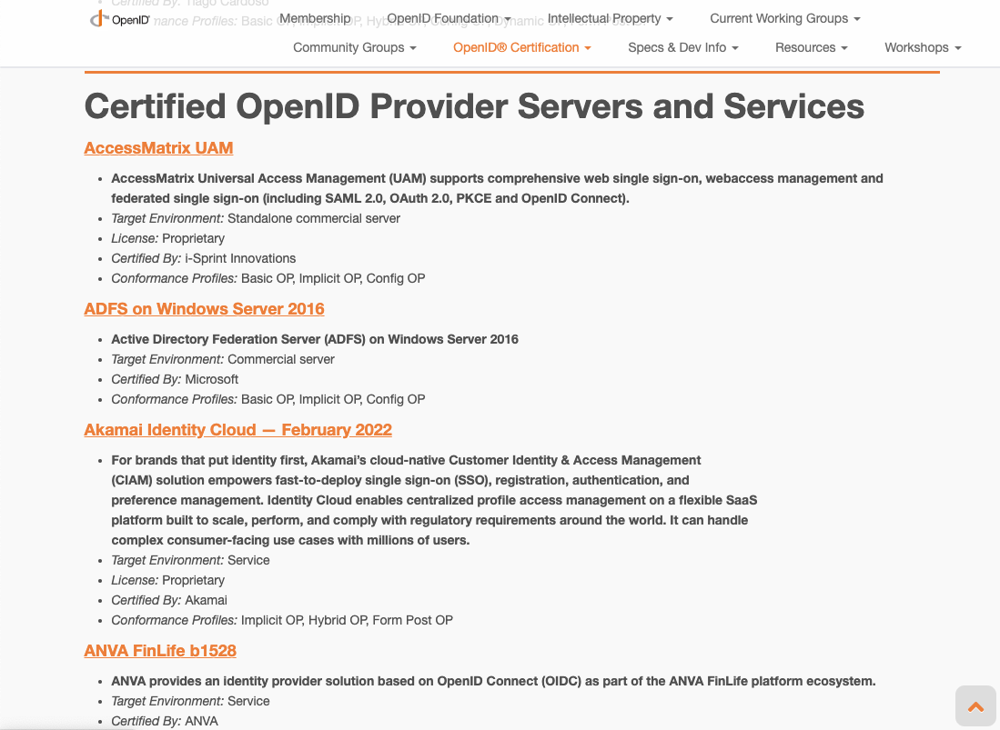
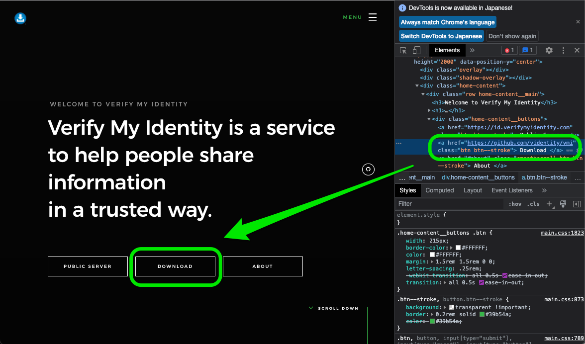

# OpenID CertifiedのOPに関するソースやライセンスを調べてみた

## 1. はじめに
この記事は DMMグループAdvent Calender 2022 の19日目の記事です。  
技術支援チームの中村です。普段は業務で横断ツールの開発や、  社内向けの認証・認可のシステムに関連した業務を行っています。

OpenIDConnect の OpenID Provider (OP) の役割で使う場合、当社では過去にAuth0を利用したこともありますが、基本的には社内の基盤を使う形が多いです。また趣味では [Keycloak](https://github.com/keycloak/keycloak) を使うことが多いのですが、下記のような疑問が時々浮かびます。

- 他の選択肢はあるのか？ 
- 他の選択肢は仕様に準拠しているのか？ 
- 他の選択肢のソースは公開されているのか？ 公開されているとしたらそれはどこか?
- 他の選択肢のライセンスはどのようになっているか？  

そんな疑問を解決するために、OpenID Foundationで認定されたOPを、
ざっくばらんに調べてみたというのが今回の記事になります。

## 2. OpenID Provider (OP) とは？
OpenIDConnectについてあまり詳しく無い方も見て居られるかもしれないので、OpenID Providerについて簡単に確認します。

OpenID ファウンデーション・ジャパンが出している、和訳した OpenID Connect Core 1.0 incorporating errata set 1 の [1. Introduction](http://openid-foundation-japan.github.io/openid-connect-core-1_0.ja.html#Introduction)を見てみると次のような記述があります。

> OpenID Connect をサポートする OAuth 2.0 Authentication Server は, OpenID Provider (OP) とも呼ばれる.

また、OpenID Connect Core 1.0 incorporating errata set 1 の [1.2.  Terminology
](http://openid-foundation-japan.github.io/openid-connect-core-1_0.ja.html#Introduction)を見てみると次のような記述もあります。

> OpenID Provider (OP)
>   End-User を Authenticate できる OAuth 2.0 Authorization Server. End-User の Authentication イベントに関する Claim を Relying Party に提供する.

また、資料の[1.3.  Overview](http://openid-foundation-japan.github.io/openid-connect-core-1_0.ja.html#Overview)の図と文章を引用すると下記になります。

> OpenID Connect プロトコルは, おおまかに言って以下のステップに従う.  
>   1. RP (Client) が OpenID Provider (OP) にリクエストを送る.  
>   2. OP は End-User を認証し, 認可を受ける.  
>   3. OP は ID Token および (通常は) Access Token を返す.  
>   4. RP は Access Token を添えて UserInfo Endpoint にリクエストを送る.  
>   5. UserInfo Endpoint は End-User の Claim を返す.  
>   これら一連のステップを以下に図示する.  

```
+--------+                                   +--------+
|        |                                   |        |
|        |---------(1) AuthN Request-------->|        |
|        |                                   |        |
|        |  +--------+                       |        |
|        |  |        |                       |        |
|        |  |  End-  |<--(2) AuthN & AuthZ-->|        |
|        |  |  User  |                       |        |
|   RP   |  |        |                       |   OP   |
|        |  +--------+                       |        |
|        |                                   |        |
|        |<--------(3) AuthN Response--------|        |
|        |                                   |        |
|        |---------(4) UserInfo Request----->|        |
|        |                                   |        |
|        |<--------(5) UserInfo Response-----|        |
|        |                                   |        |
+--------+                                   +--------+
```

## 3. OpenID Provider 探しの旅
では今回は下記の2つの条件をつけて探してみることにします。

1. [OpenID Certified](https://openid.net/certification/) の認定を受けており、[Certified OpenID Connect Implementations](https://openid.net/developers/certified/)の Certified OpenID Provider Servers and Services にリストされてること。

2. ソースが公に公開されていること (ライセンスは限定しない)

1つ目の制限についてですが、なぜOpenID Certifiedが必要かという話もあるかもしれません。これについては[OpenID Certification Frequently Asked Questions (FAQ)](https://openid.net/certification/faq/) にも似たような質問が記載されています。

> Why are the benefits of certification?

> Entities looking to use or rely on a deployment of a product or service that implements a specific conformance profile of the OpenID Connect protocol often need some assurance that the deployment actually conforms to the profile. A certification can help provide that assurance.

かなり端折って意訳すると、OpenID Foundationのプロファイルに適合しているかどうかを保証してくれるということなので、比較的に安心して使うことができます。

また、2つ目の制限については、導入の敷居を下げるために今回はソースが公開されていることを条件としたいと思います。

## 4. 調査方法について

### 4.1 調査の対象について
調査の方法としては[Certified OpenID Connect Implementations](https://openid.net/developers/certified/)のページ内の Certified OpenID Provider Servers and Services のリストを調べていこうかと思います。

イメージで言うと下記の画像の、AccessMatrix UAM, ADFS on Windows Server 2016, ... という風に約80個くらいブロックで表記されています。勿論、Gluu Server 3.1.3 と　Gluu Server 4.0.0 のようにバージョン違いも存在するので、必ずしも80 = 製品というわけではなさそうです。



また、それぞれの情報の塊のLicenseの欄を見るとProprietaryとApache 2.0の物が多いので、今回の調査では調査対象を大きく3つに分けて、Proprietary以外のものを対象とします。

- Proprietary: 
    - このケースの多くはSaaSであったりしてソースが公開されているケースがほぼない
      イメージなので、今回の調査では対象外としました。

- Apache 2.0
    - 今回の調査の対象とします。

- それ以外のLicense
    - これらの中に今回の調査対象が入っていることが見受けられたため調査の対象とします。

### 4.2 調査する項目について
調査する項目としては下記の4つで進めます。
- [Certified OpenID Connect Implementations](https://openid.net/developers/certified/)のページでの名称 (※ バージョン情報を省略します)
- [Certified OpenID Connect Implementations](https://openid.net/developers/certified/)のページでのLicense表記
- ソースリポジトリでのLicense表記 (※ 公開されているソースがある場合に限る)
- 公開されているソース

## 5 調査結果
調査した結果については下記の順で紹介していきます。

1. Apache 2.0のケース
2. Apache 2.0 以外のケース
3. License自体の記載がないケース
4. ちょっと珍しい表記のケース

### 5.1 Apache 2.0のケース
まずは Apache 2.0 Licenseのものの一覧になります。
GKIDP Broker のみ、Apache 2.0, MIT ですがこちらに含みました。

|OIDCページ内での名称|OIDCページ内でのLicense表記|ソースリポジトリでのLicense表記|公開されているソース|
|:--------------------------|:-----------------------|:-------------------|:-----------------|
|Boruta standalone|Apache 2.0|Apache-2.0|https://github.com/malach-it/boruta-server|
|Gravitee.io Access Management|Apache 2.0|Apache-2.0|https://github.com/gravitee-io/gravitee-access-management|
|Identity Server|Apache 2.0|Apache-2.0, Unknown licenses found ※1|https://github.com/wso2/product-is|
|GKIDP Broker|Apache 2.0, MIT|不明|不明 ※2|
|Keycloak|Apache 2.0|Apache-2.0|https://github.com/keycloak/keycloak|
|OIDC OP plugin 3.0.1 for Shibboleth IdP|Apache 2.0|Apache-2.0|https://github.com/CSCfi/shibboleth-idp-oidc-extension|
|ORY Hydra|Apache 2.0|Apache-2.0|https://github.com/ory/hydra|
|UAA|Apache 2.0|Apache-2.0|https://github.com/cloudfoundry/uaa|
|Verify My Identity|Apache 2.0|不明|不明 ※3|
|ZITADEL|Apache 2.0|Apache-2.0|https://github.com/zitadel/zitadel|

※1 [LICENSEファイル](https://github.com/wso2/product-is/blob/master/LICENSE)はApache-2.0なのですが、[LICENSE.txt](https://github.com/wso2/product-is/blob/master/LICENSE.txt)を見るとわかるように、利用しているライブラリのライセンスが複数あるためこのような表記になっています。

※2 [Certified OpenID Connect Implementations](https://openid.net/developers/certified/)では、KINTOテクノロジーズ株式会社の出しているGKIDP Brokerは Apache 2.0, MIT となっていますが、私の探した範囲では見つかりませんでした。

※3 公式サイトの`https://verifymyidentity.com/`のページを見てみると下記のように、DOWNLOADのボタンが `https://github.com/videntity/vmi`にリンクされています。しかしそのリンク先のGithubのページは見つからず、404エラーになります。



### 5.2 Apache 2.0 以外のケース
次にApache 2.0 以外のケースです。GÉANT OIDC-Plugin for Shibboleth IdP や、Gluu Server、 OpenAM (Open Access Manager)、Open Libertyなど公開されているものもいくつか存在しました。

|OIDCページ内での名称|OIDCページ内でのLicense表記|ソースリポジトリでのLicense表記|公開されているソース|
|:--------------------------|:-----------------------|:-------------------|:-----------------|
|AuthMachine|AuthMachine Community License|不明|不明|
|GÉANT OIDC-Plugin for Shibboleth IdP|GÉANT BSD Software License| Apache-2.0 license |https://github.com/CSCfi/shibboleth-idp-oidc-extension|
|Gluu Server|https://gluu.org/docs/ce/4.2/#license| GPL-3.0 license ※3|https://github.com/JanssenProject/jans ※4|
|HelloID|Commercial/Proprietary|不明|不明|
|IEF Experimental Claimer|Currently proprietary|不明|不明|
|OpenAM (Open Access Manager) 13|Commercial (Binary); Open Source (CDDL)|記載なし ※5|https://github.com/ForgeRock/OpenAM-Community-Edition ※6|
|Open Liberty|Eclipse Public License 1.0|EPL-1.0 license|https://github.com/OpenLiberty/open-liberty|
|Peercraft|Based on oauth2 and jose MIT licenced open source libraries|不明|不明|
|TheOptimalCloud|Service|不明|不明|

※3 [LICENSE](https://github.com/JanssenProject/jans/blob/main/LICENSE)を見る限り、GNU General Public License v3.0 でした。※4
で記載したような、Linux Foundationへの移行の影響かもしれないです。

※4 2020年に コアコードをLinux Foundationに移行することを発表し、Janssen Project という名前で Linux Foundation に移行しています。 
移行の詳細などは、[こちら](https://github.com/JanssenProject/jans#more-about-janssen-project)をご確認ください。 

また、元となった oaAuthは GluuFederationの中にいまだ[リポジトリ](https://github.com/GluuFederation/oxAuth)としては存在するようでこちらはMITライセンスです


※5 [該当リポジトリ](https://github.com/ForgeRock/openam-community-edition)のトップページにはLICENSE の表記がありませんでしたが、どうも openam-community-edition/legal/ にライセンスファイルがあるようでした。

※6 OpenAM のコミュニティ版はOSSとして出ています。ただしリストに載っている OpenAM は OpenAM13ですが、
コミュニティ版は11.0.3であり、更新されている印象はほぼないので注意が必要なイメージです。 

### 5.3 License自体の記載がないケース
そしてLicense自体が記載されていなかったケースが下記です。ほぼ製品や製品の一部のようなイメージもあります。
これらについては全てソースが見つかりませんでした。

|OIDCページ内での名称|OIDCページ内でのLicense表記|ソースリポジトリでのLicense表記|公開されているソース|
|:--------------------------|:-----------------------|:-------------------|:-----------------|
|ADFS on Windows Server 2016|記載なし|不明|不明|
|ANVA FinLife|記載なし|不明|不明|
|CA Single Sign-On|記載なし|不明|不明|
|GAïA Trust Platform|記載なし|不明|不明|
|mojeID|記載なし|不明|不明|
|myID.be|記載なし|不明|不明|
|Telekom Login|記載なし|不明|不明|
|Yahoo! ID Federation v2|記載なし|不明|不明|

### 5.4 ちょっと珍しい表記のケース
最後にちょっと珍しいLicense表記のケースにですが、License表記はあるけれど N/A というケースもあります。
個人的にはLicense自体の記載がないケースと一緒にしても良いイメージもあります。

|OIDCページ内での名称|OIDCページ内でのLicense表記|ソースリポジトリでのLicense表記|公開されているソース|
|:--------------------------|:-----------------------|:-------------------|:-----------------|
|Mobile Connect Reference Implementation|N/A|不明|不明|
|Verimi|N/A|不明|不明|

また、個人的にはProprietaryのタイポではないかと思うのですが、Proprietart という例もあります。

|OIDCページ内での名称|OIDCページ内でのLicense表記|ソースリポジトリでのLicense表記|公開されているソース|
|:--------------------------|:-----------------------|:-------------------|:-----------------|
|Grab ID|Proprietart|不明|不明|

## 6. 終わりに
認定を受けたOPをさっと調べたいなと思った時にさっと確認できる資料がないので作成しました。この資料がどなたかの参考になれば幸いです。


